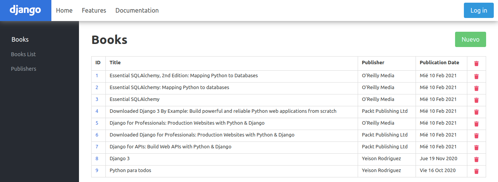
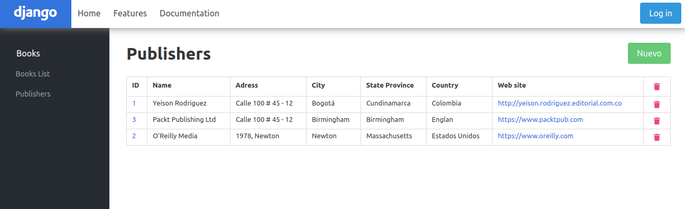
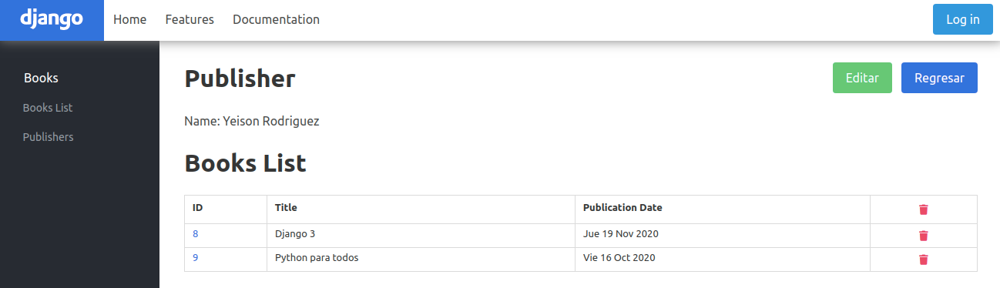
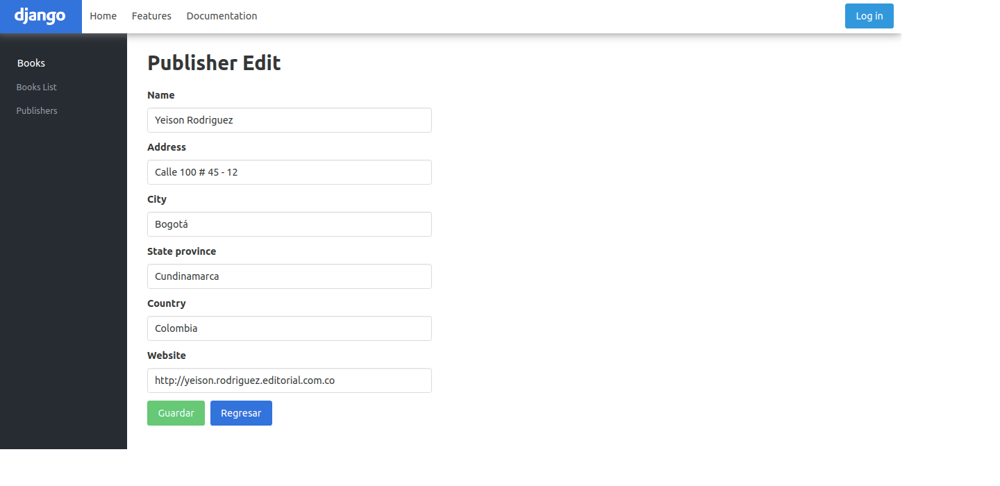
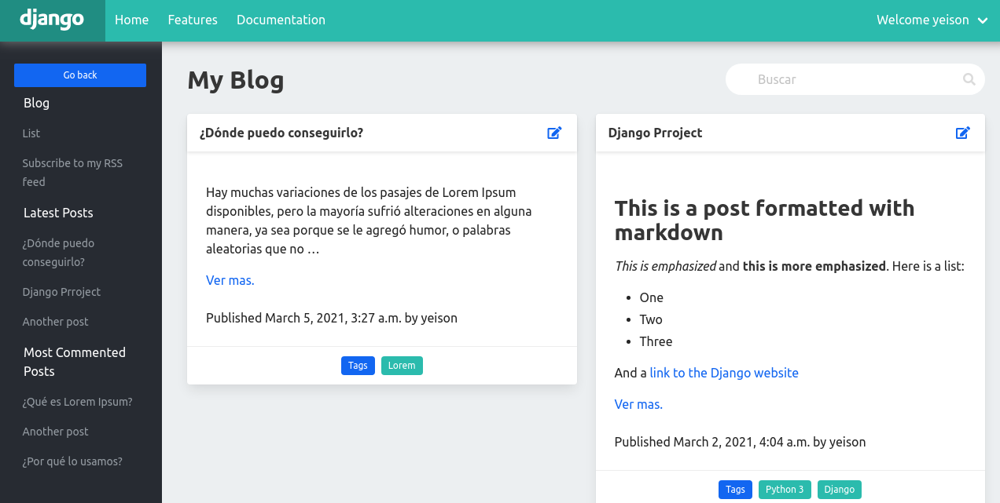
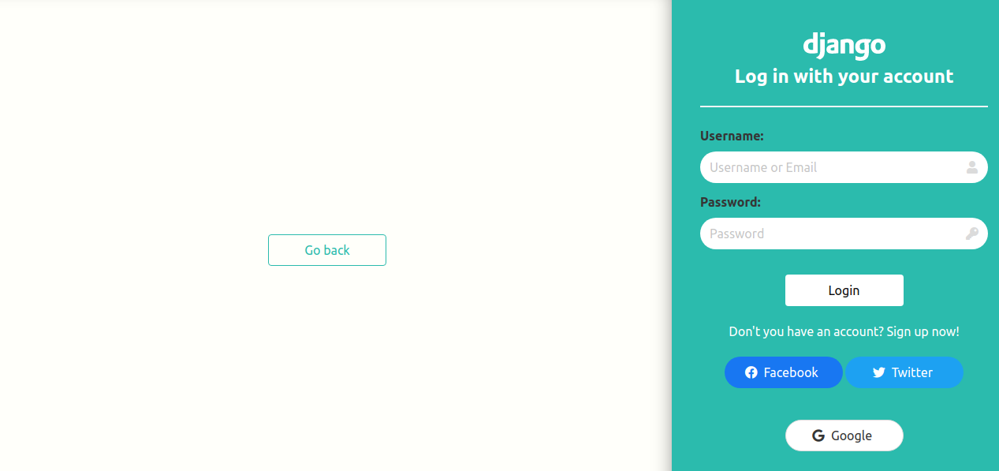
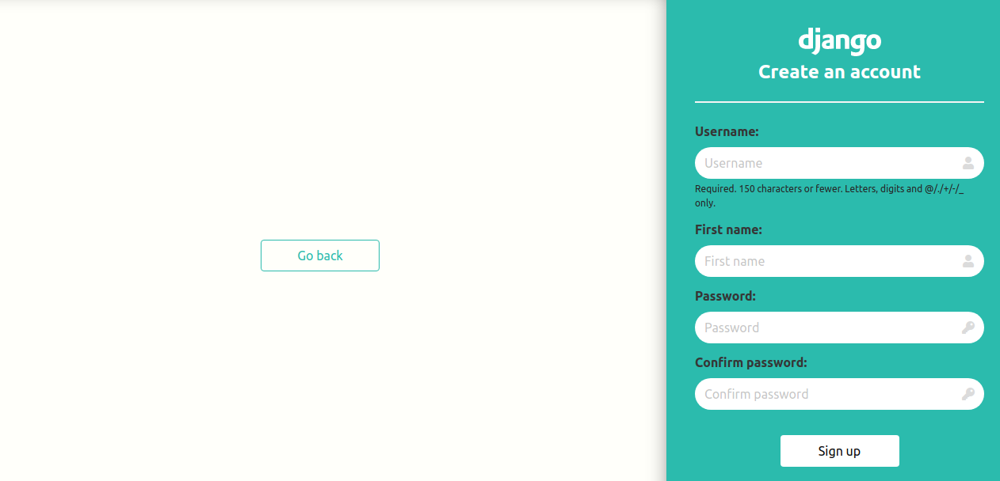

# DJANGO APPS

Proyecto de ejemplo para profundizar en la creación de aplicaciónes web con **[Django](https://www.djangoproject.com/)**

## Aplicaciones

### Books

1. Books
   
    

2. Publishers
   
    

3. Publisher Detail
  
    

4. Publisher Edit
  
    

### Blog

1. Index 
   
   

### Social web Site

1. Login
   
   

2. Signup

    